## Despliegue de aplicación para desarrollo local

Los pre-requisitos para desplegar la aplicación en un entorno local son tener instalado Docker y Docker Compose.
Basta con clonar el repositorio y ejecutar el siguiente comando en la raíz del proyecto.

```bash
docker compose up --build
```

Si ocurre algun comportamiento no deseado, recomiendo borrar los volúmenes de Docker y volver a levantar la aplicación.

```bash
 docker compose down --volumes && docker compose up --build
```

La aplicación frontend se accede en http://localhost:3000 y el panel de administración en http://localhost:8000.
Cuando se levanta la aplicación por primera vez, se crea un superusuario con las credenciales que se encuentran en el archivo .env.

Para verificar que la conexión a la base de datos se haya realizado correctamente, se puede acceder a PgAdmin4 en http://localhost:5050. Las credenciales de acceso son las que se encuentran en el docker-compose.yml.

Una modificación necesaria para poder acceder al panel de administración fue agregar el atributo is_staff al modelo User. Posteriormente se crearon las migraciones y se aplicaron. Esto puede verse en el archivo entrypoint.sh.

## Despliegue de aplicación web en AWS

### Introducción

Elegimos el servicio AWS EC2 (free tier) para desplegar nuestra aplicación web. La aplicación se encuentra dockerizada y los servicios se describen en el archivo docker-compose.yml.

EC2 nos ofrece instancias, las cuales son máquinas virtuales. Una vez lanzada la instancia, vamos a instalar en ella los servicios necesarios para que nuestra app funcione correctamente.

### 1. Crear y lanzar una instancia EC2

Buscamos el servicio EC2 y en particular la opción de lanzar una instancia.

Ahora vamos a darle un nombre, seleccionar el sistema operativo. Puesto que estoy familiarizado con las distribuciones de Linux basadas en Ubuntu y el manejo de paquetes en ellas, elegí Ubuntu Server 24.04 LTS.

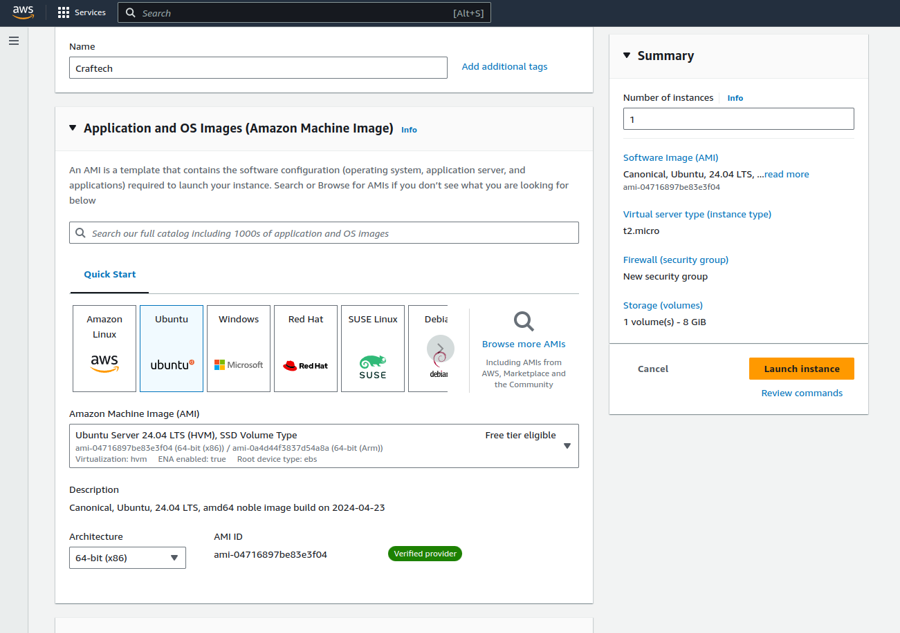

Luego, creamos un par de claves para conectarnos a la instancia de manera remota y segura via SSH. Guardamos el archivo .pem en un lugar seguro.

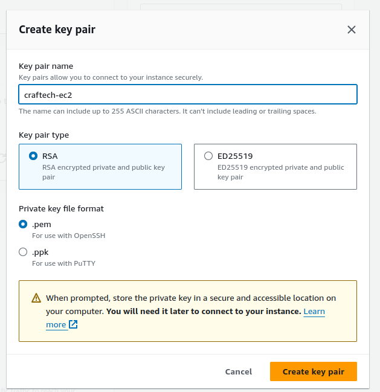

Debemos configurar el grupo de seguridad para permitir el tráfico desde internet y restringir el acceso vía SSH a nuestra IP.

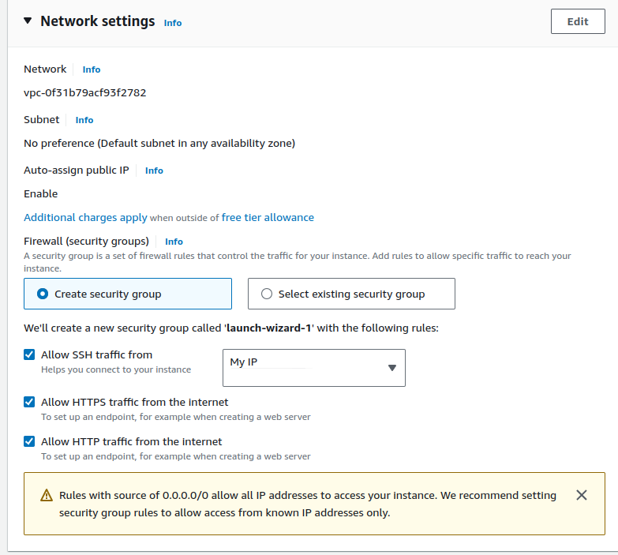

Lanzamos la instancia.

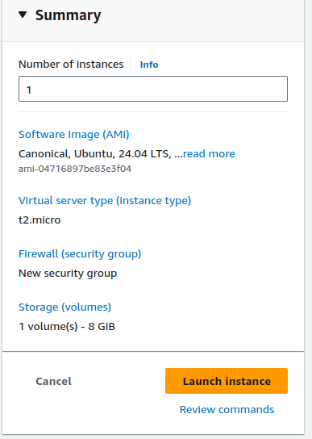

### 2. Conectarse a la instancia

Nos vamos a conectar a la instancia vía SSH. Para ello, usamos el archivo .pem que descargamos.

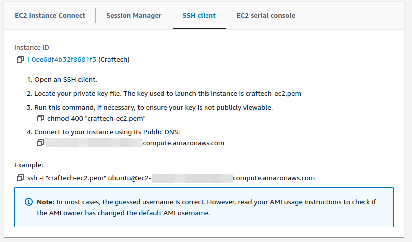

Le damos permisos al archivo .pem, abrimos una terminal y nos conectamos a la instancia.

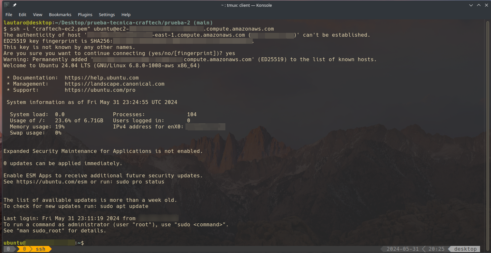

### 3. Instalar Docker y Docker Compose

Siguiendo la guía oficial de Docker, instalamos Docker y Docker Compose en la instancia.

```bash
# Add Docker's official GPG key:
sudo apt-get update
sudo apt-get install ca-certificates curl
sudo install -m 0755 -d /etc/apt/keyrings
sudo curl -fsSL https://download.docker.com/linux/ubuntu/gpg -o /etc/apt/keyrings/docker.asc
sudo chmod a+r /etc/apt/keyrings/docker.asc

# Add the repository to Apt sources:
echo \
  "deb [arch=$(dpkg --print-architecture) signed-by=/etc/apt/keyrings/docker.asc] https://download.docker.com/linux/ubuntu \
  $(. /etc/os-release && echo "$VERSION_CODENAME") stable" | \
  sudo tee /etc/apt/sources.list.d/docker.list > /dev/null
sudo apt-get update
```

```bash
sudo apt-get install docker-ce docker-ce-cli containerd.io docker-buildx-plugin docker-compose-plugin
```

Inicializamos el servicio de Docker y lo habilitamos para que se inicie en el arranque del sistema. Además, añadimos al usuario actual al grupo de Docker para evitar tener que usar sudo cada vez que ejecutamos un comando de Docker.

```bash
sudo systemctl start docker
sudo systemctl enable docker
sudo usermod -aG docker ubuntu
```

En caso de no poder usar sudo, seteamos la contraseña del usuario default (ubuntu):

```bash
sudo su -
passwd ubuntu
```

Probamos que Docker esté instalado correctamente.

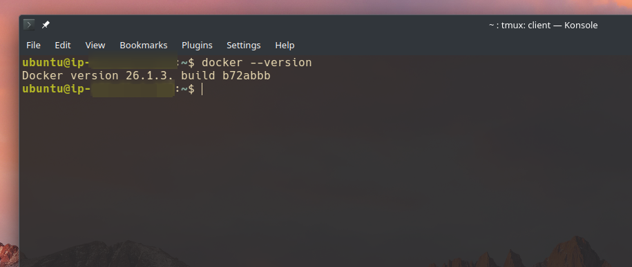

### 4. Clonar el repositorio y transferir .env

Clonamos el repositorio de la aplicación en la instancia.

```bash
git clone https://github.com/lauta-rodriguez/prueba-tecnica-craftech.git

cd prueba-tecnica-craftech/
```

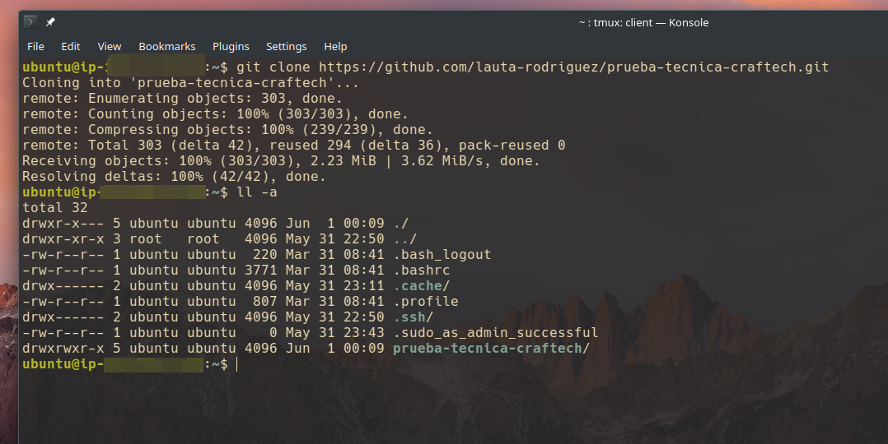

Ahora vamos a transferir el archivo .env desde mi máquina local a la instancia. Para ello, usamos el comando scp.

```bash
scp -i "key-pair.pem" path/to/.env ubuntu@ec2-public-dns:/home/ubuntu/prueba-tecnica-craftech/prueba-2/backend/
```

### 5. Configurar los puertos de la instancia

Necesitamos acceder a la aplicación frontend por el puerto 3000, al panel de administración por el puerto 8000 y a PgAdmin4 por el puerto 5050.

La aplicación frontend es accesible a todos los usuarios mientras que el panel de administración y PgAdmin4 son accesibles solo para mi IP.

Buscamos la pestaña de Security Groups y editamos las reglas de entrada.

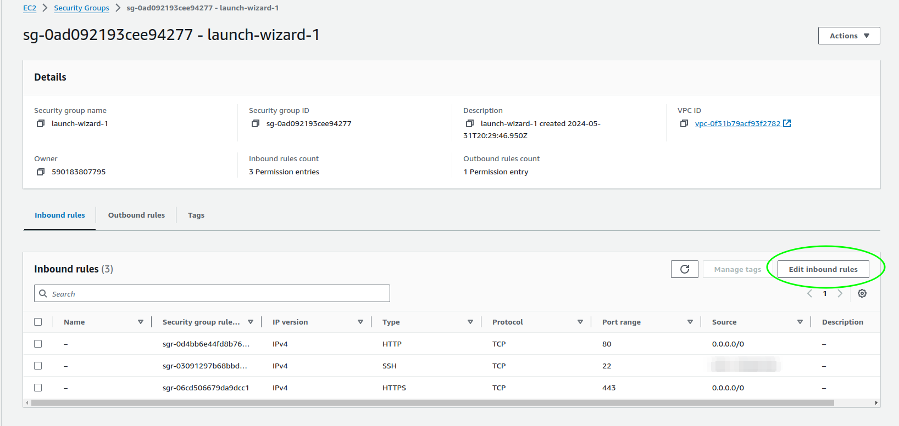

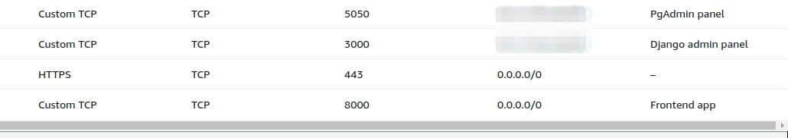

### 6. Levantar la aplicación

Levantamos la aplicación con Docker Compose.

```bash
docker compose up --build -d
```

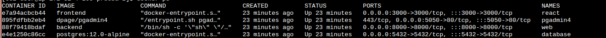
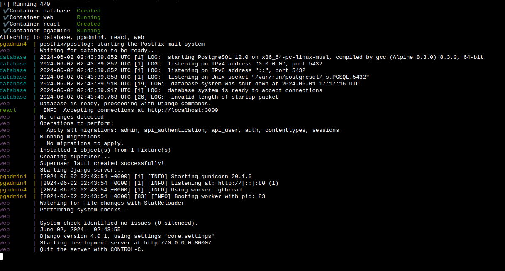
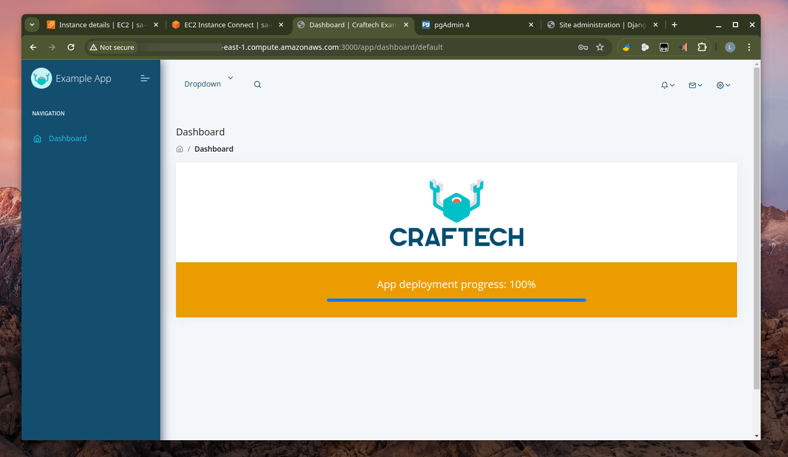
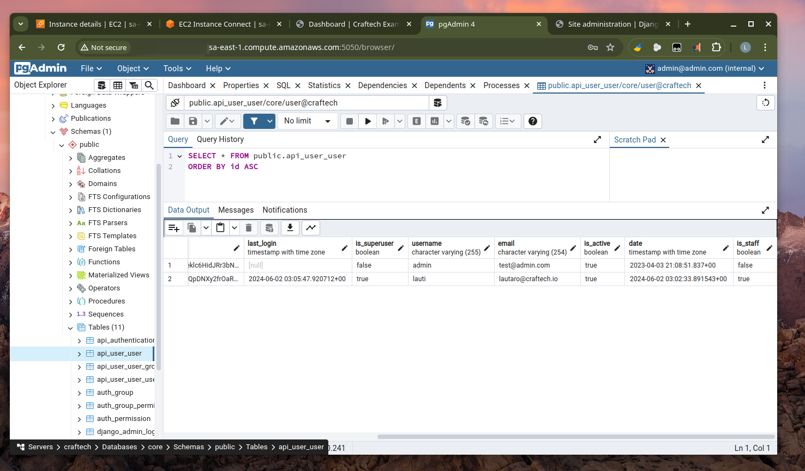
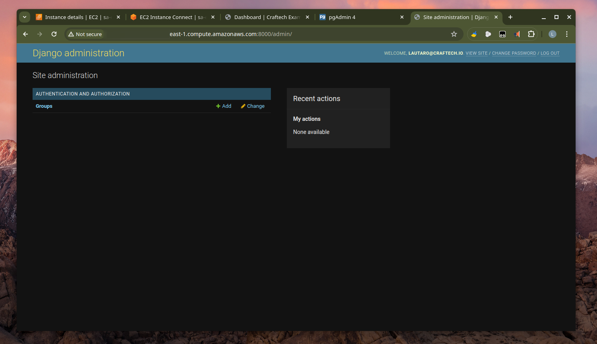

### 7. Consideraciones

- Para que la aplicación frontend pueda realizar peticiones al backend, es necesario modificar el archivo `frontend/src/config.js` y cambiar la URL de la API por la IP pública de la instancia.

- La IP de la instancia puede cambiar si se detiene y se vuelve a iniciar. Para evitar esto, se puede asignar una IP elástica a la instancia.

### Problemas (y soluciones encontradas)

- Al intentar levantar la aplicación me encontré con que no podía construir el frontend. Esto se debía a que no estaba utilizando `npm react-scripts build` para construir una versión optimizada y lista para producción. La instancia se quedaba sin memoria y perdía todo tipo de conexión con EC2.

- Además de utilizar el comando correcto para construir el frontend, usamos el paquete serve para servir la aplicación. Esto se puede ver en el archivo `Dockerfile` del frontend.

- Antes de dar con el problema, encontré que una forma de ahorrar tiempo en la construcción de los contenedores era construir las imágenes en mi máquina local, comprimirlas, transferirlas a la instancia y modificar el `docker-compose.yml` para que utilice la imagen local.

```bash
# Máquina local
docker build -t frontend .
docker save -o frontend.tar frontend
scp -i "key-pair.pem" frontend.tar ubuntu@ec2-public-dns:/home/ubuntu/

# Instancia
docker load -i frontend.tar
```

Luego de corregir esto, pude construir y correr la aplicación sin problemas.
